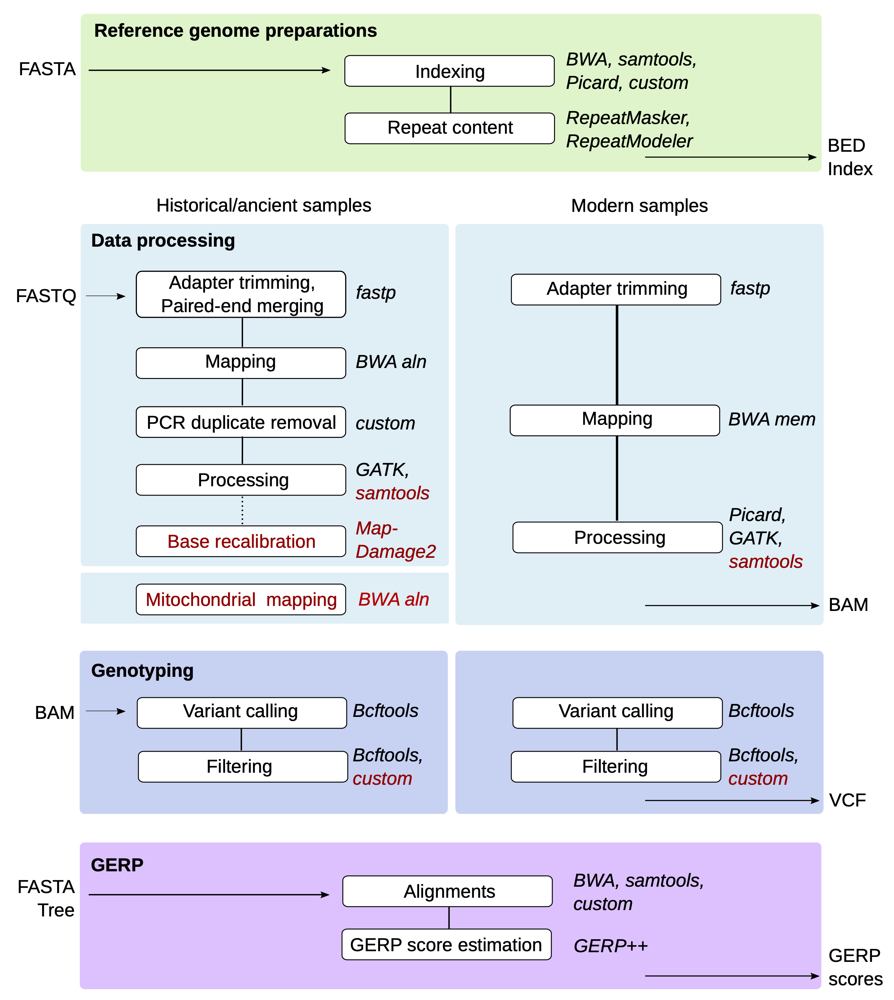
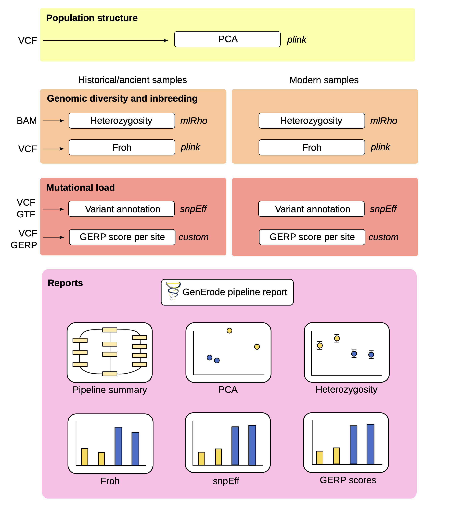

# GenErode pipeline

 

_(C) Jonas Söderberg_

GitHub repository for GenErode, a Snakemake pipeline for the analysis 
of whole-genome sequencing data from historical and modern samples to 
study patterns of genome erosion.

## Documentation

The full pipeline documentation can be found on the [repository wiki](https://github.com/NBISweden/GenErode/wiki).

## Pipeline overview

Figure 1: Overview of the GenErode pipeline data processing tracks. Input 
and output files formats, dependencies between steps, and main software used
are shown. Optional steps are highlighted in red. 

Figure 2: Overview of the GenErode pipeline data analysis tracks and final reports.
Input file formats and main software used are shown.

## Licence information

GenErode pipeline

Copyright (C) 2022  Verena Kutschera

This program is free software: you can redistribute it and/or modify
it under the terms of the GNU General Public License as published by
the Free Software Foundation, either version 3 of the License, or
(at your option) any later version.

This program is distributed in the hope that it will be useful,
but WITHOUT ANY WARRANTY; without even the implied warranty of
MERCHANTABILITY or FITNESS FOR A PARTICULAR PURPOSE.  See the
GNU General Public License for more details.

You should have received a copy of the GNU General Public License
along with this program. If not, see <https://www.gnu.org/licenses/>.
